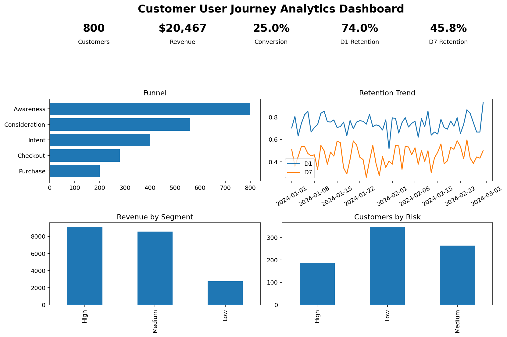
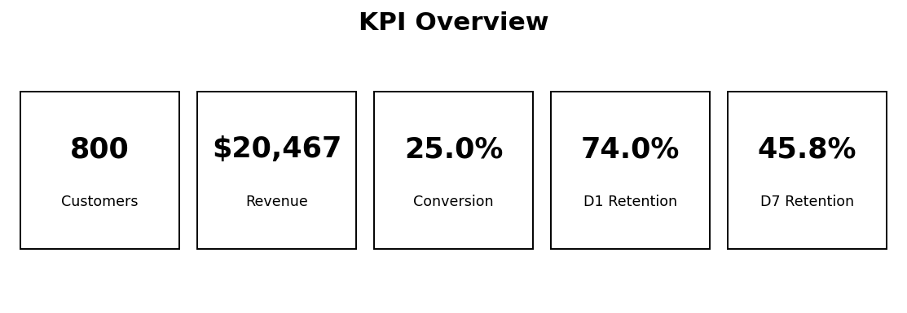
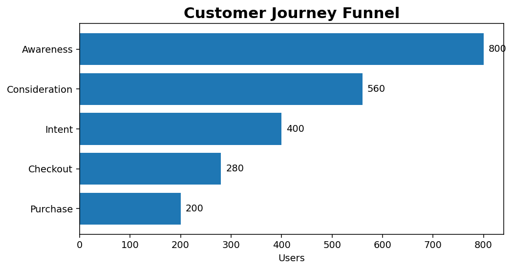
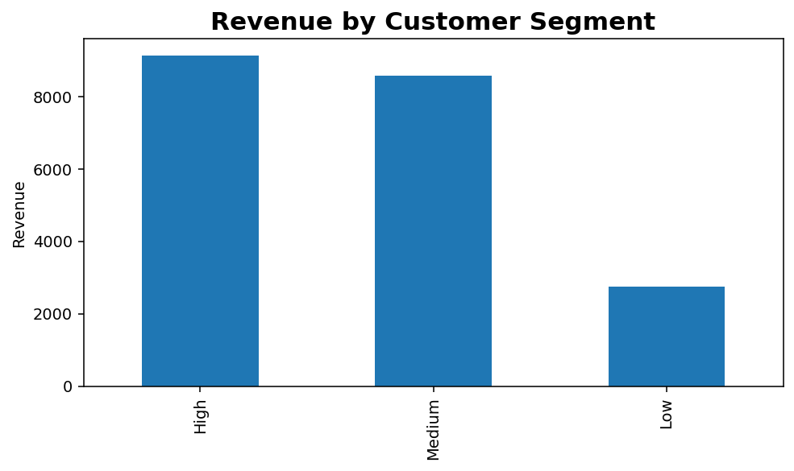

# Customer User Journey Analytics Dashboard

## Executive Summary

This project analyzes customer behavior across the full user journey to help **product, growth, and leadership teams improve conversion, retention, and revenue outcomes**.

The analysis evaluates **customer funnel progression, acquisition channels, customer segments, D1/D7 retention, churn-risk behavior, and revenue performance** to identify where customers drop off, which groups create the strongest business value, and what actions should be prioritized to improve product health.

The dashboard supports **product analytics and business decision-making** by helping teams:

- Identify high-friction funnel stages
- Improve short-term retention performance
- Prioritize higher-value acquisition channels
- Reduce churn-risk exposure
- Optimize customer segments with stronger revenue potential

Expected business value includes:

- **5–10% improvement in funnel conversion**
- **3–7% increase in D7 retention**
- **Higher revenue-per-user optimization**
- **Reduced churn-risk exposure**
- **Faster product and leadership decision-making**

This repository demonstrates end-to-end analytics capability through:

**SQL • Tableau-style Analytics • Streamlit • Python • EDA • KPI Engineering • Product Analytics Thinking**

---

## Business Problem

Product and growth teams often struggle to understand:

- Where customers drop off in the journey
- Which customer groups generate the most value
- Which acquisition channels create stronger retention
- Which churn-risk groups require intervention
- What decisions should be prioritized to improve product health

Without visibility into the customer journey, organizations risk:

- Losing customers during funnel progression
- Investing in low-performing acquisition channels
- Missing retention opportunities
- Increasing churn exposure
- Making slower business decisions without KPI visibility
---
# Decision Support Use Case

This dashboard helps business stakeholders analyze customer behavior across key touchpoints, identify conversion bottlenecks, evaluate engagement patterns, and support decisions that improve customer experience, conversion performance, and user journey optimization.

---
This project answers key business questions such as:

### Funnel Analytics
- Where do customers drop off most in the journey?
- Which stage has the highest conversion friction?

### Product & Retention Analytics
- How healthy are D1 and D7 retention?
- Which customer groups are retained longer?

### Revenue & Customer Value
- Which customer segments generate the highest revenue?
- Which channels produce stronger revenue-per-user?

### Churn-Risk Analytics
- Which customer groups require immediate intervention?
- How should churn-risk customers be prioritized?

---

## KPI Goals

| KPI | Business Purpose |
|------|----------------|
| Funnel Conversion Rate | Measures movement from awareness to purchase |
| Stage Drop-Off Rate | Identifies friction points in the customer journey |
| D1 Retention | Measures immediate product stickiness |
| D7 Retention | Measures short-term customer value |
| Revenue | Measures monetization performance |
| Revenue Per User (RPU) | Compares customer value by segment/channel |
| Customer Segment Performance | Identifies high-value groups |
| Churn Risk Category | Prioritizes retention intervention |
| Acquisition Channel Performance | Evaluates channel quality |

---

## Dataset Overview

| Item | Value |
|------|------:|
| Dataset | `user_realistic.csv` |
| Rows | 2,240 |
| Columns | 16 |
| Unique Customers | 800 |
| Date Range | 2024-01-01 to 2024-02-29 |
| Total Revenue | $20,467 |
| D1 Retention | 74.0% |
| D7 Retention | 45.8% |
| Overall Funnel Conversion | 25.0% |

### Dataset Scope

The dataset simulates a **realistic customer product journey**, including:

- Funnel stage progression
- Customer segmentation
- Acquisition channels
- Device behavior
- Retention behavior
- Revenue contribution
- Churn-risk categorization

This enables a complete **customer journey and product analytics evaluation**.

---

## Representative SQL Queries

SQL queries used for transformation and KPI analysis are included in:

```text
sql/customer_user_journey_queries.sql
```

### 1. Funnel Conversion & Drop-Off Analysis

```sql
SELECT
    funnel_stage_order,
    funnel_stage,
    COUNT(DISTINCT customer_id) AS users,
    ROUND(
        COUNT(DISTINCT customer_id) * 1.0 /
        LAG(COUNT(DISTINCT customer_id))
        OVER (ORDER BY funnel_stage_order),
        3
    ) AS conversion_from_previous
FROM user_journey
GROUP BY funnel_stage_order, funnel_stage
ORDER BY funnel_stage_order;
```

**Purpose:**  
Measures funnel conversion efficiency and identifies the largest customer drop-off stages.

---

### 2. Customer Segment Performance

```sql
SELECT
    customer_segment,
    COUNT(DISTINCT customer_id) AS users,
    SUM(revenue) AS total_revenue,
    ROUND(AVG(d1_retained), 3) AS d1_retention_rate,
    ROUND(AVG(d7_retained), 3) AS d7_retention_rate
FROM user_journey
GROUP BY customer_segment
ORDER BY total_revenue DESC;
```

**Purpose:**  
Identifies which customer groups drive stronger revenue and retention outcomes.

---

### 3. Acquisition Channel Effectiveness

```sql
SELECT
    acquisition_channel,
    COUNT(DISTINCT customer_id) AS acquired_users,
    SUM(revenue) AS total_revenue,
    ROUND(
        SUM(revenue) * 1.0 /
        COUNT(DISTINCT customer_id),
        2
    ) AS revenue_per_user,
    ROUND(AVG(d7_retained), 3) AS d7_retention_rate
FROM user_journey
GROUP BY acquisition_channel
ORDER BY revenue_per_user DESC;
```

**Purpose:**  
Evaluates acquisition efficiency using revenue-per-user and retention performance.

---

### 4. Churn-Risk Decision Signal

```sql
SELECT
    churn_risk_category,
    COUNT(DISTINCT customer_id) AS customers,
    SUM(revenue) AS revenue_exposure,
    ROUND(AVG(d1_retained), 3) AS d1_retention_rate,
    ROUND(AVG(d7_retained), 3) AS d7_retention_rate
FROM user_journey
GROUP BY churn_risk_category
ORDER BY revenue_exposure DESC;
```

**Purpose:**  
Supports churn prioritization and intervention planning.

---

## Metrics Engineering

| Metric | Formula |
|--------|---------|
| Overall Conversion | Purchase Users / Awareness Users |
| Stage Conversion | Current Stage Users / Previous Stage Users |
| Drop-Off Rate | 1 − Stage Conversion |
| D1 Retention | D1 Retained Users / Total Users |
| D7 Retention | D7 Retained Users / Total Users |
| Revenue Per User | Total Revenue / Unique Customers |
| Retention Gap | D1 Retention − D7 Retention |

### KPI Engineering Focus

This project emphasizes **product analytics KPI thinking** through:

- Funnel conversion measurement
- Retention monitoring
- Revenue quality evaluation
- Customer value segmentation
- Churn prioritization
- Product health tracking

---

## Dashboard Preview

### Main Dashboard



### Key Dashboard Views

#### KPI Overview



#### Funnel Performance View



#### Segment & Channel Analysis



---

## Product Insights

### Insight 1 — Funnel Drop-Off
The journey starts with **800 awareness users** and ends with **200 purchase users**, producing an overall funnel conversion rate of **25.0%**.

### Insight 2 — Retention Gap
D1 retention is **74.0%**, while D7 retention drops to **45.8%**, showing a short-term retention gap that should be monitored.

### Insight 3 — Segment Value
Customer segments show different revenue and retention patterns, making segmentation important for acquisition and retention decisions.

### Insight 4 — Risk Prioritization
Churn-risk groups should be monitored because revenue exposure and D7 retention vary across risk categories.

---

## Insight → Action → Recommendation → Decision

### Insight
Customers are moving through the funnel, but the largest business issue is the drop from awareness to purchase and the gap between D1 and D7 retention.

### Action
Monitor funnel stage conversion, D7 retention, revenue per user, and churn-risk category weekly.

### Recommendation
Prioritize product improvements around the highest drop-off funnel stages and create retention campaigns for medium/high churn-risk users.

### Decision
**Improve and Monitor** — continue product optimization before scaling acquisition aggressively.

---

## Decision Framework

| Decision | Rule |
|---|---|
| Ship / Scale | Strong conversion + healthy retention |
| Improve | Funnel drop-off exists but revenue signal is positive |
| Monitor | Mixed performance or unstable retention |
| Review | High churn risk or weak conversion |
| Do Not Scale | Weak funnel performance + poor retention |

---

## Measurable Business Impact

This project could help the business:

- Improve funnel conversion by **5–10%** through drop-off identification
- Increase D7 retention by **3–7%** through targeted retention actions
- Improve revenue per user by prioritizing stronger channels and segments
- Reduce churn-risk exposure by focusing on high-risk customer groups
- Shorten decision-making time by giving leadership one dashboard for product health

---

## Streamlit App

Run locally:

```bash
pip install -r requirements.txt
streamlit run app/streamlit_app.py
```

---

## Repo Architecture

```text
customer-user-journey/
├── data/
│   ├── user_realistic.csv
│   ├── user_journey_clean.csv
│   ├── funnel_summary.csv
│   ├── segment_summary.csv
│   └── risk_summary.csv
├── sql/
│   └── customer_user_journey_queries.sql
├── notebooks/
│   ├── EDA_CLEANING_FEATURE_ENGINEERING.md
│   └── eda_cleaning_feature_engineering.ipynb
├── dashboard/
│   └── dashboard_notes.md
├── screenshots/
│   ├── dashboard_preview.png
│   ├── kpi_overview.png
│   ├── funnel_view.png
│   └── segment_channel_view.png
├── app/
│   └── streamlit_app.py
├── docs/
│   └── business_decision_summary.md
├── requirements.txt
├── .gitignore
└── README.md
```

---

## Automation Awareness

Future automation options:

- Schedule SQL refreshes for weekly KPI monitoring
- Add Python data validation checks
- Use Prefect for automated data pipeline orchestration
- Connect dashboard to Snowflake, Redshift, or PostgreSQL
- Deploy Streamlit app for recruiter and stakeholder review

---

## Future Improvements

- Add cohort retention analysis
- Add A/B testing readout for funnel changes
- Add predictive churn model
- Add live database connection
- Add Tableau packaged workbook when available

---

## Final Positioning

This repository demonstrates that I can clean data, analyze KPIs, write SQL, build dashboards, recreate analytics in Streamlit, explain insights, recommend actions, and support business/product decisions.
