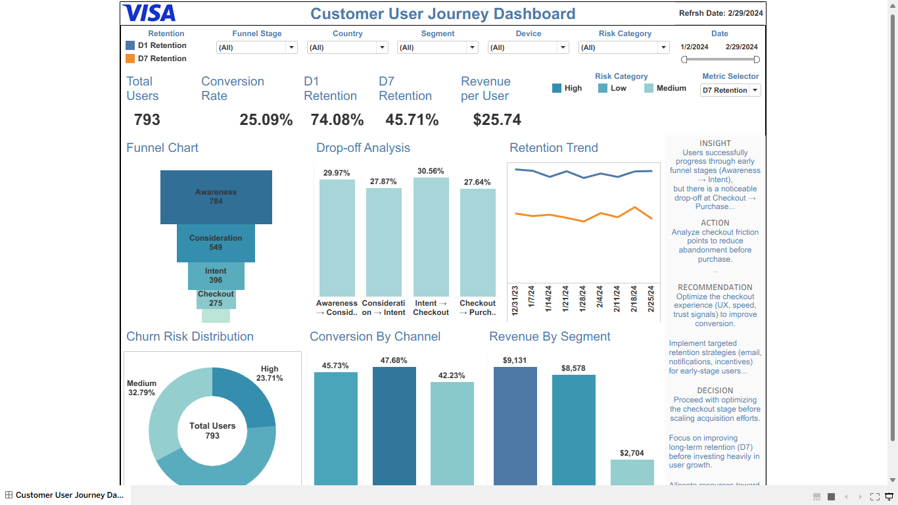

# Customer User Journey Dashboard



## Executive Summary
This project analyzes a customer journey dashboard for a Data Analyst (Healthcare & Tech) with Product Analytics skills. The dashboard connects funnel progression, retention, churn risk, acquisition channel performance, and segment revenue into a decision-ready product analytics case study.

## Business Problem
The business needs to identify where customers drop off, which channels convert best, which segments create revenue, and whether retention is strong enough to support sustainable growth.

## KPI Goals
| KPI | Value | Why It Matters |
|---|---:|---|
| Total Users | 800 | Measures product reach |
| Conversion Rate | 25.00% | Measures journey success from Awareness to Purchase |
| D1 Retention | 66.62% | Measures early user engagement |
| D7 Retention | 36.62% | Measures sustained engagement |
| Revenue per User | $25.58 | Measures monetization efficiency |

## Dataset
The dataset contains 2,240 journey-level event rows with customer, date, country, device, segment, acquisition channel, churn risk, revenue, retention flags, and funnel stage fields.

## SQL Transformations
SQL scripts are included for:
- Funnel analysis
- Retention trend analysis
- Channel and segment performance
- Churn risk analysis

## Metrics Engineering
Core metrics were engineered from customer-level and event-level data:
- Distinct user counts by stage
- Stage-to-stage drop-off
- Awareness-to-purchase conversion
- D1 and D7 retention
- Revenue per user
- Churn risk distribution

## Analytics Workflow
1. Clean and validate journey data.
2. Build funnel stage logic using ordered stages.
3. Calculate conversion, drop-off, retention, and revenue KPIs.
4. Segment by country, device, customer segment, channel, and risk category.
5. Convert findings into Insight → Action → Recommendation → Decision.

## Product Insights
- Users move successfully through early funnel stages.
- Checkout-to-purchase remains a key friction point.
- D1 retention is stronger than D7 retention, suggesting long-term engagement needs improvement.
- Churn risk distribution should guide targeted retention campaigns.
- Segment revenue differences can support better prioritization of growth investments.

## Experimentation Thinking
A strong next step is to run an A/B test on checkout optimization.

**Control:** Current checkout experience  
**Variant:** Faster checkout flow with improved UX, speed, and trust signals  
**Primary Metric:** Purchase conversion rate  
**Guardrail Metrics:** D1 retention, D7 retention, revenue per user, refund rate, support tickets  
**Decision Rule:** Ship the variant if conversion improves without harming retention or revenue quality.

## Recommendations
1. Optimize checkout friction before increasing acquisition spend.
2. Build targeted retention campaigns for high-risk users.
3. Monitor D7 retention as the main product health signal.
4. Invest more in channels and segments with stronger conversion and revenue quality.

## Decision Framework
| Decision Area | Recommendation | Expected Business Impact |
|---|---|---|
| Checkout Optimization | Improve UX, speed, and trust signals | Higher purchase conversion |
| Retention | Target high-risk users with lifecycle messaging | Stronger D7 retention |
| Growth Spend | Reallocate spend to better-performing channels | Better acquisition efficiency |
| Segment Strategy | Prioritize revenue-generating customer segments | Higher revenue per user |

## Business Impact
This project demonstrates how a product analytics dashboard can turn raw journey data into business decisions around conversion, retention, risk, and growth prioritization.

## Streamlit App
Run locally:

```bash
pip install -r requirements.txt
streamlit run app/streamlit_app.py
```

## Repo Architecture
```text
customer-user-journey-dashboard-repo/
├── data/
│   └── customer_user_journey.csv
├── sql/
│   ├── 01_funnel_analysis.sql
│   ├── 02_retention_analysis.sql
│   ├── 03_channel_segment_analysis.sql
│   └── 04_churn_risk_analysis.sql
├── notebooks/
│   └── eda.ipynb
├── dashboard/
│   └── tableau_dashboard_placeholder.md
├── screenshots/
│   └── customer_user_journey_dashboard.png
├── app/
│   ├── streamlit_app.py
│   ├── components.py
│   └── utils.py
├── docs/
│   ├── business_case.md
│   ├── dashboard_guide.md
│   └── kpi_definitions.md
├── requirements.txt
├── .gitignore
└── README.md
```

## Future Improvements
- Add cohort retention heatmap.
- Add SQL-based data validation tests.
- Add an experiment readout page.
- Deploy Streamlit app publicly.
- Add Tableau packaged workbook once finalized.
